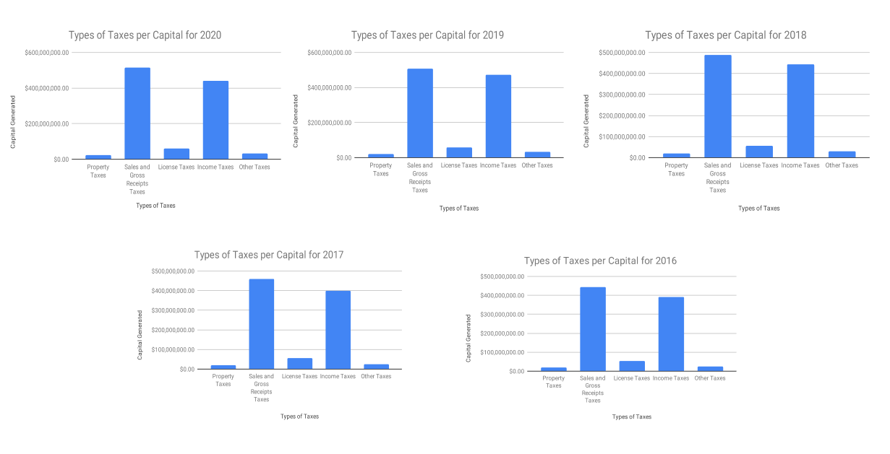
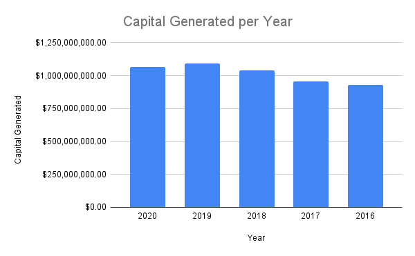

# US-State-Tax-Collections
Case Study 3: Correlation between type of tax collected (property, income, ect.) and the amounts collected.

  
  
Photo credit to <a href="https://www.pexels.com/photo/calculator-and-pen-on-table-209224/">Pixabay</a>

## Introduction 📝
The U.S. Census Bureau is a government agency with the United States designed to serve the country with information about it's population and the economy. With the United States boasting a population of 328.2 million people (est. 2018 census), there is an increased interest in how the public finance and employment data for of the nation's state and local government sector. This case study explores the amount of state tax collected depending on what kind of type of tax. 

**Business Task** \
1️⃣. Use the *'State Tax Collections by Category: US and States 2016 - 2020'* found on the U.S. Census Bureau website. \
2️⃣. Organize and analyze the data to determine the type of tax that states generate the most capital from. 

**Questions for Analysis** 
- What type of tax generates the most capital per year? The least?
- What years had the highest taxes collected? The least?

**Key Stakeholders** \
Key stakeholders in this analysis would include the Internal Revenue Service (IRS), and the U.S. Department of Treasury.

**Data Source**\
The [State Tax Collections by Category: US and States 2016 - 2020](https://data.census.gov/cedsci/table?q=United%20States&tid=GOVSTIMESERIES.GS00TC02&hidePreview=true) dataset includes details about the public finance and public employment data for the U.S. national state and local government sector. This data was released on June 21st, 2021 and it comes from the census of governments and its annual files related on a flow basis. Information in this dataset include *geographic area name, year, meaning of survey component, aggregate description, meaning of aggregate description, meaning of type of government,* and *amount formatted.* 

This dataset <i>ROCCC</i>s, meaning that it is <i>Reliable</i>, <i>Original</i>, <i>Comprehensive</i>, <i>Current</i>, and <i>Cited</i>.

## The Data Analysis Process

### 📚 Preparation of the Data 

To begin with preparation, the dataset ['State Tax Collection by Category: US and States 2016 - 2020'](https://data.census.gov/cedsci/table?q=United%20States&tid=GOVSTIMESERIES.GS00TC02&hidePreview=true) was downloaded from ['Data.Census.gov'](data.census.gov)and uploaded into Google Sheets for cleaning and analysis. 

**Files used included the following:** \
-State_Tax_Collection_2016-2020.csv

### 📈 Processing of the Data 
Data was cleaned in Google Sheets using the following steps: 
1. Checked for whitespace using the Data &rarr; Data Cleanup tab. No whitespace was found in any of the columns.
2. Checked for duplicates using the Data &rarr; Data Cleanup tab for column G (Amount Formatted). No duplicates were found.
3. Defined Column G as currency using the *format as currency* option.
4. Sorted data in descending order using the 'Year' category 

### 📊 Analysis of the Data
To analyze the data, I tackled each question as shown below as well the analytical work I performed below.  
- *What type of tax generates the most capital per year? What about the least?* 
Starting with the clean data, I pulled information from the *year, meaning of aggregate description,* and the *amount formatted* columns. With this information, I created 4 bar graphs that displyed the types of taxes and the amount of money they generated per year. The results are shown below:

  

As shown by the image above, the most profitable tax collected every year is the 'Sales and Gross Receipts Tax' which is follwed very closely behind by the 'Income Tax'. Conversely, it can be seen that the taxes that generaates the least amount of capital are 'Property Taxes' and 'Other Taxes'. As shown in the graph, however, these two taxes generate very similar amounts of money and they are unable to be differentiated from one another easily. To determine which tax generates the least amount of money, I pulled the actual amounts from 'Property Taxes' and 'Other Taxes' for each year and displayed them in a smaller table below. Included in the table is a new column titled 'Least Capital' that returns the minumum value comparing 'Property Taxes' and 'Other Taxes'. 

[Property Tax vs Other Tax](Property_Tax_Other_Tax_Yearly.csv)

As shown in the table, the least profitable tax are property taxes every year from 2020 to 2016. 

- *What years had the highest taxes collected? The least?*
In order to determine which year had the highest amount of taxes collected, I switched my attention to the Total Taxes value for each year. In order to calulate the highest and lowest tax years, I generated a bar graph that compared total capital generated per year. The results are shown below. 

  

As shown in the bar graph above, 2019 generated the most taxes in total. Contrastedly, 2016 generated the least amount of taxes. 

### 🎯 Conclusion

To conclude, the most profitable tax that generate the most capital is the 'Sales and Gross Receipts Tax' while the tax that generates the least amount of money is the "Property Tax'. Additinoally, the most profitable Tax Year was 2019 and the least profitable tax year was 2016. 

### 🚩 Follow-Up Questions 

1. Is there a correlation between motor collisions and street infrastructure?
2. What are the populations of each borough? And does this impact the amount of motor collisions?
3. Is there a correlation between zip code and motor collisions? Is there a correlation between month and motor collisions?
